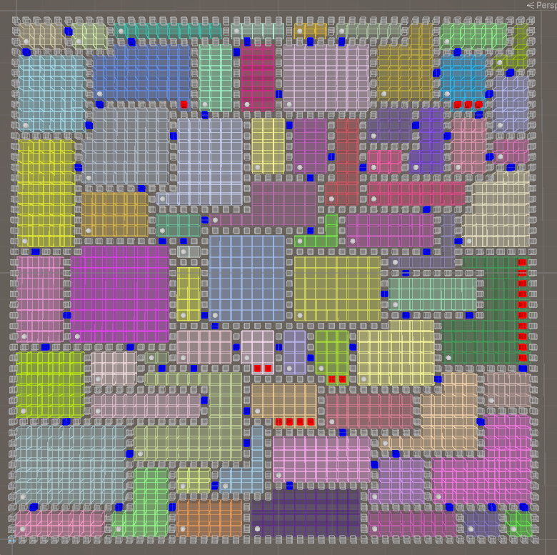

# PurgeProtocol
Robots purging roaches!

## Overview

This project is a procedural map generator built in Unity using C#. It creates a grid-based layout of interconnected rooms with walls and doors, ensuring all rooms are accessible via a minimum spanning tree algorithm. The generator supports customizable grid sizes, room dimensions, and door placement rules. The codebase is designed for extensibility, with plans to integrate advanced algorithms like Wave Function Collapse (WFC) and A* pathfinding in the future.

## Features
Current Implementation

    Grid-Based Room Generation:

        Randomly sized rooms placed within a configurable grid.

        Walls automatically generated around each room.

    Connectivity:

        Union-Find (Disjoint Set Union) algorithm to ensure all rooms are connected via doors.

        Optional extra doors for non-critical connections (controlled by extraDoorChance).

    Visualization:

        Unity Gizmos for real-time debugging of rooms, walls, and doors.

        Color-coded rooms for easy distinction.

    Optimizations:

        Double-wall removal to smooth out room edges.

        HashSets for efficient spatial queries.

## Future Implementations
1. Wave Function Collapse (WFC)

    Goal: Generate more structured or thematic maps using pre-defined tile rules.

    Use Case: Create objects (wall interfaces, chargers, etc) with adjacency constraints.

    Integration: Combine WFC with the current room generator for hybrid layouts (e.g., hand-crafted rooms with procedural corridors).

2. A* Pathfinding

    Goal: Enable NPCs or players to navigate the map efficiently.

    Use Case: Enemy AI movement, player pathfinding hints, or map analysis (e.g., finding choke points).

    Integration: Use the generated grid (wallSet, roomSet) to build a navigation graph.

3. Additional Features

    Procedural Content: Traps, loot, and environmental hazards.

    3D Visualization: Convert the 2D grid into a 3D mesh with modular assets.

    Optimization: Spatial partitioning (e.g., Quadtree) for large grids.

## Technologies Used

    Unity: Core framework for visualization and execution.

    C#:

        Procedural generation algorithms.

        HashSet and Dictionary for spatial management.

    Union-Find (Disjoint Set Union): Ensures map connectivity.

    Gizmos: Debug visualization of rooms, walls, and doors.

## Getting Started
### Prerequisites

    Unity 2021.3 or later.

    Basic understanding of procedural generation concepts.

### Usage

    Attach the Script:

        Add RoomGenerator.cs to a GameObject in your Unity scene.

    Configure Parameters:

        Adjust gridWidth and gridHeight for map size.

        Set room size ranges (minRoomSizeX/Y, maxRoomSizeX/Y).

        Tweak extraDoorChance for additional connections.

    Run the Scene:

        Press Play to generate the map.

        Use the Scene view to inspect rooms (colored cubes) and doors (blue cubes).

### Code Structure

    Room Class: Stores room coordinates, walls, doors, and debug color.

    Door Class: Represents connections between rooms.

    UnionFind Class: Generic implementation for connectivity checks.

    Key Methods:

        GenerateRooms(): Creates rooms and walls.

        GenerateDoors(): Connects rooms using minimum spanning trees.

        AttachDoubleWallsToRooms(): Smooths room edges.

## Contributing

### Contributions are welcome! Open issues or PRs for:

    Implementing WFC or A*.

    Enhancing door placement logic.

    Adding 3D visualization.

## License

MIT License. See LICENSE for details.

### Let’s build something awesome together! 🚀
